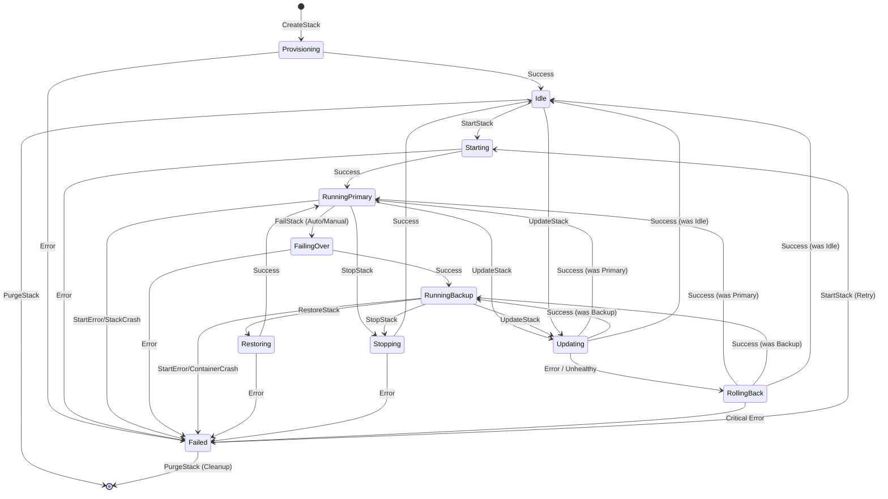

# FloatLab Run Stack and State Machine

Each stack will have a state machine that will emit lifecycle events via RAFT to all hosts.
Each running node will keep a local state machine tracking the lifecycle of the container.

## Container State Machine

The state machine manages the distributed consensus on where and how a container should be running.

## States

#### Provisioning (Transitional)
**Description:** Creating networks, volumes, and ZFS replication.
**Next States:**
- `Success` => `Idle`
- `Error` => `Failed`

#### Idle
**Description:** Container is configured but not running. Volumes are prepared.
**Next States:**
- `StartStack` => `Starting`
- `PurgeStack` => `(Deleted)`

#### Starting (Transitional)
**Description:** Launching the container on the primary host and waiting for health checks.
**Next States:**
- `Success` => `RunningPrimary`
- `Error` => `Failed`

#### RunningPrimary
**Description:** Container is up and healthy on the primary host.
**Next States:**
- `StopStack` => `Stopping`
- `FailStack` => `FailingOver` (to Backup)
- `ContainerCrash` => `Failed`

#### RunningBackup
**Description:** Container is up and healthy on the backup host after a failover.
**Next States:**
- `RestoreStack` => `Restoring` (to Primary)
- `StopStack` => `Stopping`
- `ContainerCrash` => `Failed`

#### FailingOver (Transitional)
**Description:** Transitioning service from primary host to backup host (due to failure or manual request).
**Next States:**
- `Success` => `RunningBackup`
- `Error` => `Failed`

#### Restoring (Transitional)
**Description:** Syncing data from backup back to primary and restarting on primary.
**Next States:**
- `Success` => `RunningPrimary`
- `Error` => `Failed`

#### Stopping (Transitional)
**Description:** Gracefully shutting down the container.
**Next States:**
- `Success` => `Idle`
- `Error` => `Failed`

#### Updating (Transitional)
**Description:** Applying configuration changes (e.g., resource limits, image updates, environment variables).
**Next States:**
- `Success` => `RunningPrimary` (if previously primary)
- `Success` => `RunningBackup` (if previously backup)
- `Success` => `Idle` (if previously idle)
- `Error / Unhealthy` => `RollingBack`

#### RollingBack (Transitional)
**Description:** Reverting to the previous known-good configuration after a failed update.
**Next States:**
- `Success` => `RunningPrimary` (if previously primary)
- `Success` => `RunningBackup` (if previously backup)
- `Success` => `Idle` (if previously idle)
- `Critical Error` => `Failed` (if rollback itself fails)

#### Failed
**Description:** The service encountered a fatal error (crash, start error, or provisioning failure).
**Next States:**
- `StartStack` => `Starting` (Attempt to restart)
- `PurgeStack` => `(Deleted)` (Clean up broken service)

## Events

Events are the primary mechanism for state transitions and are propagated via RAFT consensus.

#### CreateStack (stackId, stackConfig)
Creates foundational infrastructure for a stack.
- CreatePrimaryVolumes
- CreateBackupVolumes
- CreateNetworks
- CreateBackupFilesystem

#### UpdateStack (stackId, updatedStackConfig)
Updates the infrastructure shared by all containers in a stack.
- UpdateNetworks (e.g., DNS, gateways)
- UpdateFilesystems (e.g., quota, mount points)
- Notify affected services (triggering UpdateStack if necessary)

#### CreateStack (stackId, serviceConfig)
**Transitions:** `[*] => Provisioning`
Provision the service on the primary and backup hosts.
- CreateNetwork
- CreatePrimaryVolumes
- CreateBackupVolumes
- CreateZfsReplication
- CreateContainer

#### StartStack (stackId)
**Transitions:** `Idle => Starting`, `Failed => Starting`
Starts stack on primary host.
- Configure Network Routing
- StartContainer
- WaitOnHealthCheck

#### FailedStack (stackId, mode = auto/manual)
**Transitions:** `RunningPrimary => FailingOver`
Marks stack as failed on primary and starts it on backup.
- WaitToConfirmNodeFailure (mode == auto)
- StartContainerOnBackup
- WaitOnHealthCheck

#### RestoreStack (stackId)
**Transitions:** `RunningBackup => Restoring`
Syncs back the stack volumes and restarts service on the primary host.
- PreRestoreBackup - Snapshot volumes on primary host
- PreRestoreSync - Initial sync from backup to primary
- PreRestoreStop - Stop service on the backup host
- RestoreSync - Final delta sync from backup to primary
- RestoreRun - Start service on the primary host

#### UpdateStack (stackId, updatedConfig)
**Transitions:** `RunningPrimary => Updating`, `RunningBackup => Updating`, `Idle => Updating`
Updates the service configuration and restarts the stack if necessary. Automatically rolls back if the service fails to start or pass health checks.
- BackupCurrentConfig
- UpdateContainerConfig
- PullNewImage (if changed)
- RestartContainer (if required)
- WaitOnHealthCheck
- **Rollback Logic (if failure):**
    - RestorePreviousConfig
    - RestartContainer (if required)
    - WaitOnHealthCheck

#### StopStack (stackId)
**Transitions:** `RunningPrimary => Stopping`, `RunningBackup => Stopping`
Stops running stack.
- Wait for all containers to stop

#### PurgeStack (stackId)
**Transitions:** `Idle => [*]`, `Failed => [*]`
Deletes all traces of the service.
- DeleteContainer, Networks, Logs, Volumes

## Concurrency & RAFT Interaction

- **Log Ordering:** All state changes MUST be initiated by a RAFT log entry. The state machine only transitions *after* the log is successfully applied to the local FSM.
- **Transitional State Protection:** While in a transitional state (e.g., `Starting`), the system should reject conflicting commands (e.g., `FailStack`) until the transition completes or times out.
- **Fail-Fast:** If a transitional step fails, the system transitions to `Failed` to allow for manual inspection or explicit retry.

